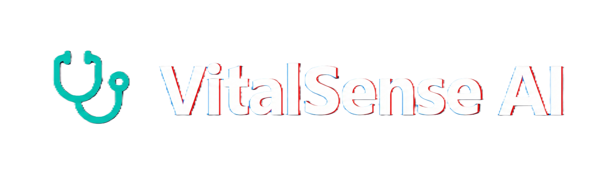
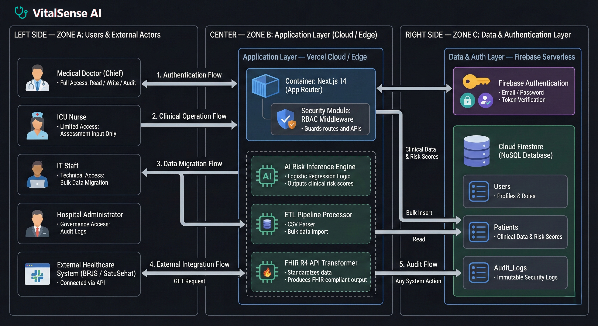
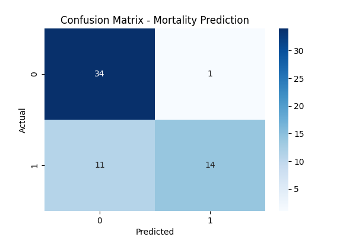

<div align="center">
  
  <h1>VitalSense AI: Clinical Decision Support System</h1>
  
  <p>
    <strong>Next-Generation ICU Mortality Prediction & Interoperability Platform</strong>
  </p>

  <p>
    <a href="https://nextjs.org">
      
    </a>
    <a href="https://react.dev">
      
    </a>
    <a href="https://firebase.google.com">
      
    </a>
    <a href="https://tailwindcss.com">
      
    </a>
    <a href="https://hl7.org/fhir">
      
    </a>
    <a href="#">
      
    </a>
  </p>
</div>

<br />

## 📋 Overview

**VitalSense AI** is an advanced Clinical Decision Support System (CDSS) engineered to assist medical professionals in the Intensive Care Unit (ICU). By leveraging Logistic Regression Machine Learning models, the platform predicts patient mortality risk in real-time based on clinical vitals.

Beyond prediction, VitalSense AI is built as a complete **Health Informatics Ecosystem**, featuring strict Role-Based Access Control (RBAC), automated Data Migration pipelines (ETL), immutable Audit Logs for governance, and full interoperability with external systems via **FHIR R4 API** standards.

---

## 🏗️ System Architecture

The system follows a robust 3-Tier Architecture designed for security, scalability, and performance.

<div align="center">
  
</div>

* **Zone A (User & Actors):** Handles diverse user roles (Doctors, Nurses, IT Staff) and external API consumers (BPJS/SatuSehat).
* **Zone B (Application Layer - Vercel):** The core Next.js engine containing the AI Inference Logic, ETL Processors, and Security Middleware.
* **Zone C (Data Layer - Firebase):** Serverless backend handling Authentication and NoSQL Firestore database for high-speed data retrieval.

---

## 🚀 Key Features (The "Monster" Capabilities)

VitalSense AI integrates **SC4 (Operational)**, **SC5 (Integration)**, and **SC6 (Governance)** modules into a single unified platform.

### 🏥 SC4: Operational Efficiency
* **ICU Command Center:** A real-time dashboard visualization of total patients, critical risk alerts, and operational statistics.
* **Smart Assessment Form:** Interactive clinical input form that triggers the AI engine to calculate mortality risk instantly.
* **Data Migration Engine (ETL):** A powerful tool for IT Staff to bulk upload legacy patient data via CSV. The system automatically parses, transforms, and loads data into the cloud while providing real-time terminal logs.

### 🔗 SC5: Integration & Security
* **FHIR R4 Interoperability:** A dedicated API endpoint (`/api/fhir/[id]`) that converts internal patient data into the global HL7 FHIR standard JSON, enabling seamless data exchange with EMRs.
* **Strict RBAC (Role-Based Access Control):**
    * **Medical Doctor:** Full access.
    * **Nurse:** Assessment input only.
    * **IT Staff:** Technical migration & integration only (No patient PII access).
    * **Hospital Admin:** Governance & logs only.
* **Secure Authentication:** Powered by Firebase Auth with email verification protocols.

### 🛡️ SC6: Governance & Synthesis
* **Immutable Audit Trail:** Every login, data input, and API access is cryptographically recorded in a tamper-proof ledger for security compliance.
* **AI Explainability:** The system provides transparent risk scores with detailed clinical breakdowns (e.g., Creatinine levels, Ejection Fraction).

---

## 🧠 Machine Learning Core

The heart of VitalSense AI is a **Logistic Regression** model trained on the open-source **[Heart Failure Clinical Records Dataset](https://www.kaggle.com/datasets/rithikkotha/heart-failure-clinical-records-dataset?resource=download)**. We prioritize *Interpretability* and *Reliability* for medical contexts.

<div align="center">
  
</div>

**Understanding the Performance:**
The Confusion Matrix above visualizes the model's accuracy during testing:
* **True Positives (Bottom-Right: 14):** The model correctly identified 14 patients who were at critical risk. This is crucial for saving lives.
* **True Negatives (Top-Left: 34):** The model correctly identified 34 stable patients, preventing unnecessary resource allocation.
* **High Sensitivity:** The model is tuned to minimize *False Negatives*, ensuring critical patients are rarely missed.

---

## 📂 Project Structure

VitalSense AI maintains a clean, modular, and scalable codebase architecture.

```bash
VITALSENSE-AI-PLATFORM
├── .next/                  # Build artifacts
├── diagram/                # Architecture diagrams & assets
│   ├── no-bg-vitalsense-ai-logo.png
│   ├── vitalsense-ai-logo.png
│   └── vitalsense-architecture-2.png
├── ml-research/            # Machine Learning workspace
│   ├── datasets/           # Raw clinical CSV data
│   ├── notebooks/          # Python training scripts (.ipynb)
│   └── output/             # Model metrics & matrix images
├── public/                 # Static assets
├── src/
│   ├── app/                # Next.js App Router (Pages)
│   │   ├── api/fhir/[id]/  # FHIR R4 API Endpoint
│   │   ├── dashboard/      # Protected System Modules
│   │   │   ├── governance/ # SC6 Audit Module
│   │   │   ├── integration/# SC5 FHIR Module
│   │   │   └── migration/  # SC4 ETL Module
│   │   ├── login/          # Auth Entry
│   │   └── register/       # User Registration
│   ├── components/         # Reusable UI Blocks
│   │   ├── business/       # Logic-heavy components (RiskCard, Forms)
│   │   ├── charts/         # Visualization components
│   │   ├── layout/         # Sidebar, Header, Layout Wrappers
│   │   └── ui/             # Atomic UI elements
│   └── lib/                # Utilities & Logic
│       ├── ml-logic/       # JS Inference Engine
│       ├── AuthContext.js  # Authentication State Management
│       ├── firebase.js     # Firebase Config
│       ├── logger.js       # Centralized Audit Logger
│       └── SearchContext.js# Global Search State
├── .env.local              # Environment Variables
├── package.json            # Dependencies
└── tailwind.config.js      # Styling Configuration
```

---

## ⚡ Getting Started

To run this "Monster System" locally on your machine:

1. **Clone the repository**
    ```bash
    git clone [https://github.com/bangaji313/VitalSense-AI-Clinical-Platform.git](https://github.com/bangaji313/VitalSense-AI-Clinical-Platform.git)
    ```
    ```bash
    cd VitalSense-AI-Clinical-Platform
    ```

2. **Install Dependencies**
    ```bash
    npm install
    ```

3. **Configure Environment** Create a .env.local file in the root directory and add your Firebase credentials:
    ```bash
    NEXT_PUBLIC_FIREBASE_API_KEY=your_api_key
    NEXT_PUBLIC_FIREBASE_AUTH_DOMAIN=your_project.firebaseapp.com
    NEXT_PUBLIC_FIREBASE_PROJECT_ID=your_project_id
    NEXT_PUBLIC_FIREBASE_STORAGE_BUCKET=your_bucket
    NEXT_PUBLIC_FIREBASE_MESSAGING_SENDER_ID=your_sender_id
    NEXT_PUBLIC_FIREBASE_APP_ID=your_app_id
    ```

4.  **Run Development Server**
    ```bash
    npm run dev
    ```

5. Access the Platform Open http://localhost:3000 in your browser.

---

## 📄 License & Acknowledgments

* **Project License:** This software is developed for educational purposes (Applied Health Informatics Final Exam). Use responsibly.
* **Dataset Attribution:** Based on *Heart Failure Clinical Records* (Davison Chicco & Giuseppe Jurman, 2020), available on [Kaggle](https://www.kaggle.com/datasets/rithikkotha/heart-failure-clinical-records-dataset?resource=download).

---

<div align="center">
  <p>Developed with ❤️ and ☕ using Next.js & Firebase</p>
  <p>© 2026 VitalSense AI Project</p>
</div>